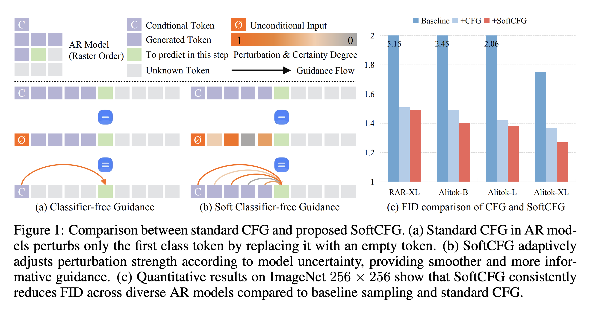

# SoftCFG: Uncertainty-Guided Stable Guidance for Visual Autoregressive Models


## Overview

SoftCFG is an open-source implementation of the uncertainty-guided inference method described in the paper *"SoftCFG: Uncertainty-Guided Stable Guidance for Visual Autoregressive Model"* ([arXiv:2510.00996](https://arxiv.org/abs/2510.00996)). This framework addresses key challenges in applying Classifier-Free Guidance (CFG) to autoregressive (AR) models for image generation, such as guidance diminishing and over-guidance. SoftCFG distributes adaptive perturbations across generated tokens based on their uncertainty, ensuring stable and persistent guidance while resolving conflicts between text conditions and visual coherence. It introduces Step Normalization to bound cumulative perturbations for long-sequence stability.

The method is training-free, model-agnostic, and compatible with existing AR pipelines like AliTok ([arXiv:2506.05289](https://arxiv.org/abs/2506.05289), [GitHub](https://github.com/ali-vilab/alitok)) and RAR ([arXiv:2411.00776](https://arxiv.org/abs/2411.00776), [GitHub](https://github.com/bytedance/1d-tokenizer)). Experiments on ImageNet 256×256 show state-of-the-art FID scores among AR models, e.g., reducing FID from 1.37 to 1.27 on AliTok-XL.

## Features

- **Uncertainty-Guided Perturbation**: Adaptively scales value caches based on token confidence (e.g., 1 - p_max) to provide context-aware guidance, reducing artifacts like duplicated objects.
- **Step Normalization**: Bounds cumulative perturbations to prevent guidance explosion, ensuring stability in long sequences.
- **Compatibility**: Seamlessly integrates with AR models like AliTok (B/L/XL variants) and RAR, supporting class-conditional and text-to-image generation.
- **Performance Gains**: Achieves SOTA FID on ImageNet 256×256 (e.g., 1.27 on AliTok-XL), with negligible inference overhead (e.g., <1% slowdown).

## Installation

### Prerequisites

- Python 3.8+
- PyTorch 2.0+ (with CUDA for GPU acceleration)
- Accelerate (for distributed training/inference)
- Transformers, NumPy, Pillow, and other basics (see `requirements.txt`)
- Optional: WANDB for logging, ADM evaluator for FID computation

### Steps

1. Clone the repository:
   ```bash
   git clone https://github.com/[your-username]/SoftCFG.git
   cd SoftCFG
   ```

2. Create a virtual environment (recommended):
   ```bash
   python -m venv venv
   source venv/bin/activate 
   ```

3. Install dependencies:
  Please follow the installation instructions for the base AR models: AliTok and RAR: 
4. Download pre-trained models:
   - AliTok models: From [Google Drive](https://drive.google.com/drive/folders/1dBjcFfClmBvf2cSlelFMT2gMlS8OQOHG?usp=sharing) (e.g., tokenizer and AR checkpoints for B/L/XL).
   - RAR models: From [1d-tokenizer GitHub](https://github.com/bytedance/1d-tokenizer) (check README_RAR.md for checkpoints).

5. Prepare evaluation tools (for ImageNet FID):
   ```bash
   git clone https://github.com/openai/guided-diffusion.git
   cd guided-diffusion/evaluations
   wget https://openaipublic.blob.core.windows.net/diffusion/jul-2021/ref_batches/imagenet/256/VIRTUAL_imagenet256_labeled.npz
   cd ../..
   ```

## Usage

SoftCFG is applied during inference on top of base AR models. Below are examples for class-conditional generation on ImageNet 256×256.

### Basic Example with AliTok-XL

Generate 50k samples with SoftCFG:
```bash
cd SoftCFG/alitok &&\
torchrun --nnodes=1 --nproc_per_node=8 sample_imagenet.py \
  --config configs/alitok_xl.yaml \
  --experiment.output_dir="output/softcfg_alitok_xl" \
  --experiment.generator_checkpoint="weights/alitok_xl.bin" \
  --model.generator.guidance_scale=9 \
  --model.generator.guidance_scale_pow=1.5 \
  --model.generator.softcfg_strength=1 \ # use 0 to ignore softcfg
  --model.generator.step_norm=True
```

Evaluate FID:
```bash
python guided-diffusion/evaluations/evaluator.py \
  VIRTUAL_imagenet256_labeled.npz \
  output/softcfg_alitok_xl.npz
```

### Command-Line Arguments

- `--softcfg_strength`: 'cfg' (baseline) pls set this as 0 or 'softcfg' (ours) pls set this as 1.
- `--guidance_scale`: Strength of guidance.
- `--guidance_scale_pow`: Pow of Cosine guidance.
- `--step_norm`: Enable Step Normalization (bool, default True).
- For full options, run `python sample_imagenet.py --help`.

### Example Output

Generated images are saved as .png files in the output directory. For metrics, expect FID ~1.27 on AliTok-XL with SoftCFG.


## Contributing

We welcome contributions! To contribute:

1. Fork the repository.
2. Create a new branch (`git checkout -b feature-branch`).
3. Make your changes and commit (`git commit -m "Add support for new AR model"`).
4. Push to the branch (`git push origin feature-branch`).
5. Open a pull request describing your changes.

Please adhere to PEP 8 standards and include tests for new features.

## License

This project is licensed under the MIT License. See the [LICENSE](LICENSE) file for details.

## Citation

If you use SoftCFG, please cite our paper:

```bibtex
@article{SoftCFG2025,
  title={SoftCFG: Uncertainty-Guided Stable Guidance for Visual Autoregressive Model},
  author={Dongli Xu and Aleksei Tiulpin and Matthew B. Blaschko},
  journal={arXiv preprint arXiv:2510.00996},
  year={2025},
  url={https://arxiv.org/abs/2510.00996}
}
```

## Acknowledgments

This implementation builds on AliTok ([GitHub](https://github.com/ali-vilab/alitok)), RAR ([GitHub](https://github.com/bytedance/1d-tokenizer)) and Lumina-mGPT2.0 ([GitHub](https://github.com/Alpha-VLLM/Lumina-mGPT-2.0)) . Thanks to the original authors for their foundational work.

## Contact

For questions, open a GitHub issue or email dongliixu@gmail.com.